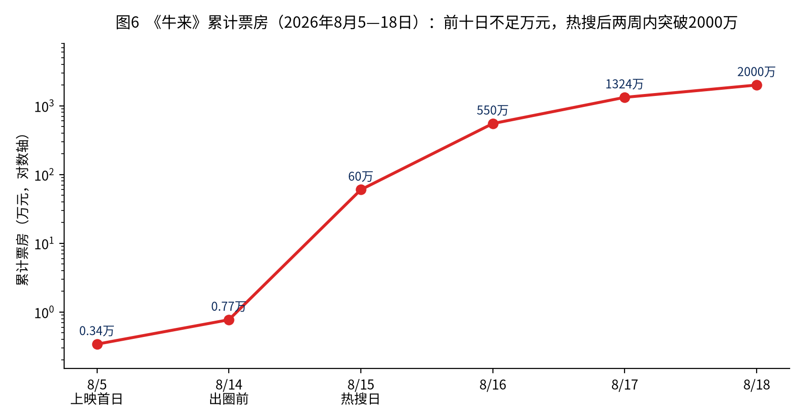
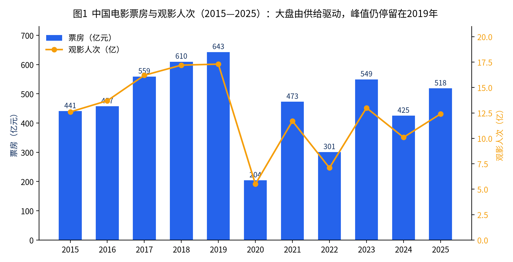
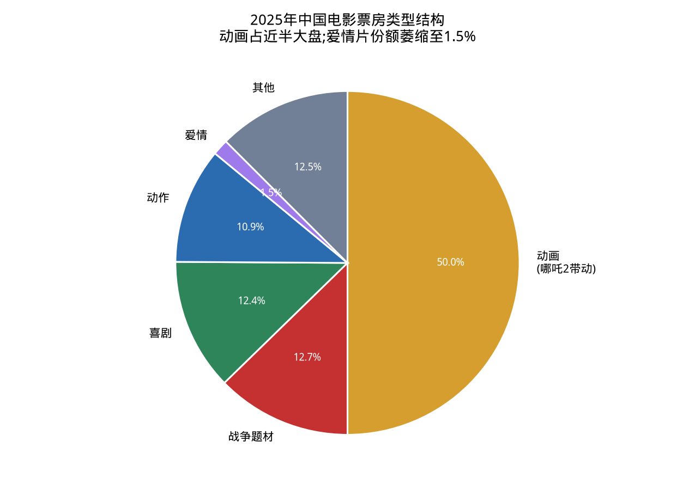
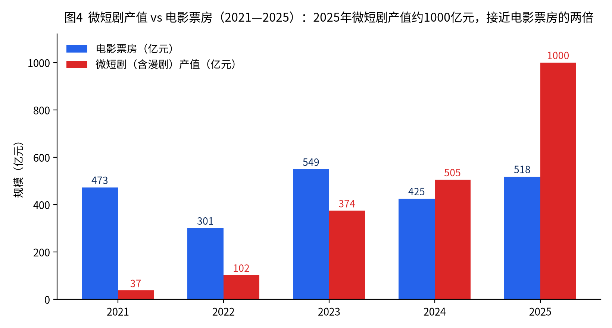
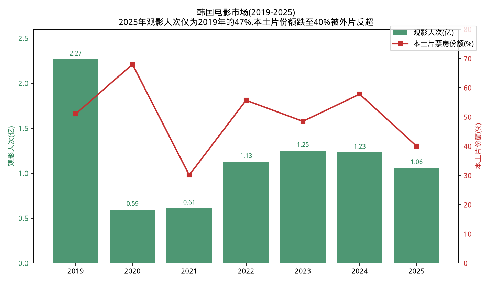
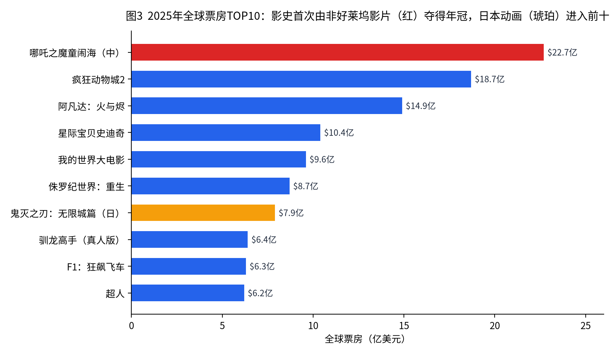

# 中国电影市场深度分析报告

**——制度、人群、供给、冲击与全球坐标下的产业前瞻**

*(撰写时间:2026年8月;主体数据截至2025年度行业统计,《牛来》专题跟踪至2026年8月18日)*

---

## 目录

1. [发审制度与"看不见的电影":制度缺陷与文化背景](#一发审制度与看不见的电影制度缺陷与文化背景)
2. [专题:《牛来》逆袭解剖](#专题2026年暑期档牛来逆袭解剖制度缝隙情绪市场与草根叙事)
3. [中国新人群:对主流文化的抵触与自我审视在电影上的投射](#二中国新人群对主流文化的抵触与自我审视在电影上的投射)
3. [专业影业公司在方向审美与题材选择上的盲点](#三专业影业公司在方向审美与题材选择上的盲点)
4. [社会深度诉求与影视产品供给的悖论](#四社会深度诉求与影视产品供给的悖论)
5. [票房变化趋势与上映内容的关系:火爆的题材、缺乏的题材与经典电影的价值观影响](#五票房变化趋势与上映内容的关系火爆的题材缺乏的题材与经典电影的价值观影响)
6. [线上媒体与AI短剧对传统电影的冲击](#六线上媒体与ai短剧对传统电影的冲击)
7. [传统电影的优势与未来发展潜力](#七传统电影的优势与未来发展潜力)
8. [电影消费场景优化:"影院+"的发展状况](#八电影消费场景优化影院的发展状况)
9. [好莱坞大片的发展趋势](#九好莱坞大片的发展趋势)
10. [韩国电影的发展状况与背景](#十韩国电影的发展状况与背景)
11. [全球电影发展趋势与票房最佳电影分析](#十一全球电影发展趋势与票房最佳电影分析)
12. [结论与战略研判](#十二结论与战略研判)

---

## 核心数据速览(2025年度)

| 指标 | 数值 | 同比 |
| --- | --- | --- |
| 中国全年电影票房 | 518.32亿元 | +21.95% |
| 城市院线观影人次 | 12.38亿 | +22.57% |
| 国产片票房占比 | 79.67%(412.93亿元) | — |
| 全年生产影片 | 764部(故事片511部) | — |
| 获公映许可证("龙标")影片 | 约373部 | -48.6% |
| 备案立项影片 | 2342部 | -14.2% |
| 银幕总数 | 93,187块(净增2219块) | — |
| 微短剧+漫剧全年产值 | 约1000亿元 | 接近电影票房的两倍 |
| 全球票房 | 约335.5亿美元 | +12%(按历史汇率) |
| 全球年度票房冠军 | 《哪吒之魔童闹海》22.7亿美元 | 影史首次由非好莱坞影片夺冠 |
| 韩国全年票房 | 1.047万亿韩元 | -12.4%(本土片份额跌至约40%) |

---

## 一、发审制度与"看不见的电影":制度缺陷与文化背景

### 1.1 制度框架:一备二审与"龙标"

中国电影管理实行**剧本(梗概)备案 + 影片审查**的"一备二审制",法律依据是《电影产业促进法》(2017年施行)与《电影管理条例》。基本流程为:

- **备案立项**:开拍前剧本梗概报省级电影主管部门备案;涉及国家安全、外交、民族、宗教、军事、公安、司法、历史与文化名人、敏感历史事件等"特殊题材",须征得相关主管部门意见;重大革命和历史题材、重大文献纪录片、中外合拍片须报国家电影局立项审批。
- **成片审查**:摄制完成后送审,省级初审、国家电影局终审,通过后颁发《电影公映许可证》——片头4秒的"龙标"。未获龙标的影片不得发行、放映、进口、出口。

### 1.2 数据揭示的"漏斗":从备案到上映的高损耗

2025年的供给侧数据呈现出一个急剧收窄的漏斗:**备案立项2342部(同比-14.2%),获龙标影片仅约373部(同比-48.6%),全年新上映约448部(含往年获证影片与进口片)**。对照产量口径,全年生产影片764部、故事片511部,而票房过亿影片仅51部。也就是说:

- 从"备案"到"获证"的转化率长期低于三成,且2025年获证数量近乎腰斩;
- 从"获证"到"有效上映"(获得可感知排片)之间还存在第二道漏斗;
- 从"上映"到"回本"之间存在第三道漏斗——2025年单片《哪吒之魔童闹海》占大盘近三成,头部之外的腰部影片生存空间被极度压缩。

大量影片停留在"备案未拍""拍完未审""过审未映"的中间态,形成业内所称的**积压片**现象。典型案例如《九龙城寨之围城》从开机到上映历时约7年、《彷徨之刃》拍完后沉寂4年才定档。积压原因混合了审查修改、出品方资金链断裂、档期博弈等多重因素,但审查的不确定性是其中最难以由市场主体自行管理的变量。

### 1.3 制度缺陷的结构性分析

从制度经济学角度,现行发审体系存在五个可辨识的结构性问题:

**(1)标准的模糊性与结果的不可预期性。**《电影产业促进法》列举的禁止内容(危害国家统一、宣扬淫秽赌博暴力、诋毁民族优秀文化传统等)属于原则性条款,缺少可操作的细则与判例公开机制。同一尺度在不同年份、不同题材、不同审查语境下伸缩明显,制片方只能靠"经验、人脉与试错"来估计过审概率。这实质上是把政策风险转嫁给了产业资本。

**(2)缺少分级制,导致"就低不就高"的内容天花板。**中国是全球主要电影市场中少数不实行分级制的国家。所有过审影片默认面向"全年龄",审查尺度必须按最保守的观众群设定,惊悚、犯罪、社会批判、性与暴力等成人向表达空间被系统性压缩。分级缺位同时伤害两端:创作者失去表达空间,家长失去对未成年人的甄别工具。

**(3)事前审查+全流程干预的高成本模式。**审查不仅发生在成片阶段,还前置到剧本备案、后延到宣发物料、档期,甚至上映后仍可能因舆情下映(近年多部影片"技术原因"撤档)。全流程的不确定性显著抬高融资成本——影视项目本就是高风险资产,叠加政策风险后,金融机构与外部资本对内容行业的风险定价进一步恶化,这是2018年影视资本退潮之后行业融资难的重要底层原因之一。

**(4)特殊题材协审机制造成"部门否决权"叠加。**涉军、涉警、涉司法、涉历史的题材需相关部委协审,任何一个协审部门的保留意见都可能使项目搁浅。结果是现实题材创作向"安全区"收敛:警匪片倾向境外叙事(如东南亚犯罪题材)、司法题材倾向正面歌颂式呈现,真正触及体制内部张力的叙事极其稀缺。

**(5)申诉与救济机制薄弱。**复审机制存在但透明度低,未过审影片通常得不到公开、具体的理由说明,也缺少第三方仲裁通道。影片被"无限期搁置"与被"明确否决"之间界限模糊,制片方连止损决策都难以做出。

### 1.4 文化与历史背景:为什么是这样的制度

发审制度并非凭空产生,理解它需要三个背景维度:

- **文以载道的治理传统。**从古代"教化"观念到近代救亡叙事,中国的主流政治文化始终把文艺视为意识形态工具与社会教化载体,而非单纯的私人消费品。电影自延安时期起就被纳入宣传体系,"寓教于乐"中"教"的优先级在制度设计中高于"乐"。
- **管理体制的路径依赖。**电影管理职能2018年由原广电总局划入中央宣传部(对外保留国家电影局牌子),标志着电影被进一步确认为意识形态阵地而非普通文化产业。审查权向上集中与"属地初审"下放并存,形成"收放循环":市场过热或舆情敏感期收紧,产业困难期放松(如2023-2024年一批积压片集中获准上映即被解读为纾困信号)。
- **社会共识层面的"保护主义"文化。**相当一部分公众(尤其是家长群体)对暴力、色情、"三观不正"内容持强干预立场,分级制多次讨论未果,既有管理部门不愿让渡裁量权的因素,也有社会舆论对"分级=开放尺度"的疑虑。审查制度在民意层面并非没有支撑,这是与西方语境讨论审查时最大的不同。

### 1.5 小结与改革方向研判

短期内取消事前审查不具现实可能,但边际改良存在明确空间:**审查标准细则化与案例公开、承诺时限与说明理由义务、艺术影院线/电影节展的差异化尺度试点(参考"全国艺联"扩容)、以"分线发行"间接实现事实上的受众分层**。2024年起推行的分线发行改革,客观上为小众、尖锐题材提供了一个不与主流大盘争空间的出口,值得持续观察。

2026年8月上映的动画电影《牛来》,把上述制度特征推到了公众视野的正中央:**审查拦的是红线,不是完成度;能过审不等于能被市场看见,但一旦被看见,规则缝隙本身就会变成传播素材。** 下一专题对这部影片的逆袭做完整解剖。

---

## 专题:2026年暑期档《牛来》逆袭解剖——制度缝隙、情绪市场与草根叙事

《牛来》不是一部"拍得好所以卖得好"的电影,而是一部把中国电影市场几条暗线同时点亮的样本。它能过审、能上院线、能从7千元票房翻到2千万元量级,三件事各自成立,合在一起才构成"逆袭"。把它们拆开看,比把影片本身神化或贬低都更有解释力。

### 专题.1 事实清单:一部几乎不存在的电影如何变成事件

| 项目 | 事实 |
| --- | --- |
| 片名/类型 | 《牛来》,国产三维动画,86分钟 |
| 上映 | 2026年8月5日全国院线"裸映"(仅一张水墨海报,几乎零宣发) |
| 主创 | 导演信雨萌 + 编剧/配音/片尾曲孙丽芳(母子二人);无外包、无动作捕捉、自称未用AI |
| 出品 | 大连璟园文化影视传媒有限公司(前身装修公司,2021年7月更名;注册资本10万元,年报参保1人) |
| 备案/龙标 | 影动备字〔2021〕第104号;电审动字〔2024〕第33号 |
| 制作周期 | 约5年;设备多为闲鱼二手家用电脑;据报道成本约16万元,无外部投资 |
| 剧情内核 | 牛犊"牛来"与云雀入梦,在蛇、豹、狼与母爱的感召下成长为敢于担当的勇士,梦醒后跟上族群 |
| 票房轨迹 | 首日约数百至三千元;前9–10日累计约7,000–7,700元、观影约200余人、排片一度仅剩4场;8月14日起因社交媒体爆发,15日单日票房即超20万,17日破千万,18日突破2,000万 |
| 后续 | 大连部分影院因"影响城市形象"下架;导演称"院线阶段正式落幕";电商已出现周边;二创几乎不受出品方约束 |

发行方曾劝导演"别上了",导演的回应是"好不容易做出来了,就帮他上一下院线"。这句话几乎是整场事件的钥匙:**创作动机是完成心愿,不是占领市场;市场后来自己长出了需求。**

### 专题.2 它为什么能过审:不是制度松了,是制度本来就不审"好不好"

公众的第一反应是"这么糙怎么能拿龙标"。这个疑问把审查想象成了质量门槛。实际分工要精确得多:

1. **内容审查看导向,不看完成度。**《牛来》讲小牛成长、母爱、担当、友谊、保护弱者,价值表达贴合"正向、全年龄、无色情暴力、无政治敏感"的最低公约数。审查要拦的是红线,不是"地摊鸡汤"或建模崩坏。正向成长内核反而使它比许多更精致、更尖锐的影片更容易过。
2. **技术审查看放映安全,不看工业水准。**业内人士对澎湃等媒体的解释很明确:技审查坏帧、音画不同步、长时间黑屏、解码故障。能完整播完86分钟,就可以过。家用电脑渲出来的粗糙三维,只要不卡盘、不花屏,就不构成否决理由。
3. **属地初审的松紧并不均匀。**审查权已部分下放到省级电影主管部门,国家电影局主要复核重点题材。北京、上海、广东等产业密集省份会顺带看基础完成度;产量较小的省份更倾向"手续齐、内容安全即可"。大连并非影视重镇,一部低敏感动物寓言更容易走完流程。
4. **动画题材本身是安全区。**动物拟人、梦境成长、无真人、无当代社会场景,既避开特殊题材协审(军/警/司法/民族/历史名人),也避开真人片对表演、服化道的最低观感预期。动画在审查结构里是"低风险通道",《哪吒2》走的是这条通道的天花板,《牛来》走的是地板。
5. **流程对普通人理论上是开放的。**备案、送审、技审、密钥发行是公开程序,不绑定院线资本或明星阵容。信雨萌自己跑完全套拿到龙标,证明门槛在"合规"而不在"圈内资格"。真正的产业门槛发生在过审之后:没有宣发预算、没有排片谈判筹码的影片,会在院线里默默死掉——《牛来》前十日就是这个默剧。

**结论:过审不是奇迹,是制度设计的必然结果。**审查系统优化的是政治与道德风险,不是审美风险;它允许一部"安全而拙劣"的影片进入市场,同时拦下大量"精致而不安全"的影片。公众把两者当成同一把尺子,才会觉得荒谬。荒谬感本身,后来变成了传播燃料。

### 专题.3 票房为什么能翻盘:五层机制叠在同一周

前十日7千元、两周内2千万元,斜率来自五层机制同时点燃,缺一层都不会是这个量级。

**(1)反差制造"必须亲眼确认"的动机。**水墨海报承诺的是国风治愈,正片交付的是崩坏建模与僵硬对白。屏摄(尽管违规)把这种反差送进短视频。观众的决策从"要不要看好电影"变成"要不要验证传说"——后者对边缘观众的动员力远强于前者。同期《奥德赛》《欢迎来龙餐馆》越精致,《牛来》作为差异化情绪出口就越显眼。

**(2)社交媒体把嘲讽改写成集体仪式。**豆瓣从一星差评迅速变成反讽五星("开创中国动画先河""今年院线最佳");热搜在8月14–15日密集霸榜;观众驱车几十公里"见证历史",影院手搓海报整活,部分场次甚至比大片更满。这是典型的邪典(cult)动员:**内容越不堪,到场本身越像参与一场公共笑话。**票价约20元,低于一杯奶茶,猎奇的经济门槛几乎为零。

**(3)幕后叙事完成了从"嘲笑"到"共情"的情绪翻面。**母子二人、装修公司跨界、60后妈妈学编剧并唱片尾曲、五年无投资、主板烧过、发行方劝退仍坚持——这些信息比影片本身更完整、更好传播。观众可以一边笑画面、一边敬创作者。**猎奇负责把人拉进影院,母子追梦负责让人愿意把票钱花出去并二次传播。**没有后一层,它只会停在梗图,到不了千万票房。

**(4)多重可解读性让不同圈层各自取义。**官方是成长寓言;股民把"牛来"读成A股隐喻("今年股民必看");二创把角色拆成表情包;严肃影评尝试做梦境与物种政治解读。一部完成度极低的文本,因为留白过大,反而变成开放的投射屏。这与本报告第二节的判断一致:可二创性本身就是商业资产——只是《牛来》的可二创性来自失控,而不是设计。

**(5)院线排片被舆论倒逼,形成正反馈。**前十日排片从245场掉到4场,是常规市场出清;热搜之后全国排片一夜回到百余场,影院为截留热度主动加场。排片增加→更多屏摄与到场凭证→热搜维持→再加场。这是短视频时代院线被社交媒体"远程遥控"的极端案例,也说明当前排片机制对腰部、头部之外的内容几乎没有发现功能,只对已经爆发的话题做被动响应。

### 专题.4 文化与社会心理:它到底满足了什么深度诉求

把《牛来》仅仅写成"烂片营销成功",会漏掉它与2026年社会情绪的对齐。

- **对精致工业的倦怠。**哪吒级的工业奇观提高了"好"的天花板,也提高了审美疲劳。当所有大片都在比特效与宣发密度,一种毫不掩饰的业余质感会显得"真"。它不是对主流文化的意识形态反抗,而是对主流文化**生产工艺**的戏谑。
- **对AI时代的手工崇拜。**2025年已被称作"AI短剧元年"。一部公开拒绝AI、用二手电脑手搓五年的长片,踩中了"算法把一切变光滑"之后的逆反。《牛来》的糙,被重新编码成"还有人肯笨拙地做一件没用的事"。
- **普通人圆梦的替代性满足。**审查与资本双重门槛让"我也能做电影"长期像笑话;《牛来》把笑话演成了真的。它满足的不是对电影艺术的需求,而是对**通道仍然存在**的确认——哪怕通道通向的是被嘲笑。
- **低风险的公共狂欢。**它不涉及政治争议、不要求立场站队,嘲讽它不会惹麻烦,支持它也不像站队。这种低政治风险的集体起哄,在表达空间收窄的舆论场里格外稀缺,因此能量很大。
- **片名的民俗与金融双重彩头。**2021年立项时取名图的是牛年与父亲属相的吉兆;2026年被股民征用为"牛市将至"的寓言。民俗彩头让它不像彻底的恶作剧,金融彩头给了第二波到场理由。

戏内是小牛在母亲庇护下长大,戏外是母亲陪儿子熬过五年。这条同构比任何台词都更有力,也解释了为什么嘲笑会转化成保护欲——观众在保护的不是影片,是"被允许笨拙"这件事本身。

### 专题.5 它不是可复制的商业模式,但是一份清楚的产业诊断书

《牛来》很难被有意复制。刻意做一部更烂的电影去博出圈,会立刻被识别为投机,失去"五年真心"这层不可伪造的伦理光环;没有母子叙事、没有海报与成片的巨大落差、没有恰好撞上暑期档大片缝隙,流量不会自动变成购票。虎嗅等评论把它概括为多重偶然叠加,判断是准确的。

它真正有价值的是诊断,而不是配方:

1. **审查与质量的错位被公众看见了。**以后讨论"龙标含金量",不能再默认龙标等于最低工业标准。政策若要回应舆论,更可行的不是收紧内容红线,而是把"完成度"从潜规则变成可选的分级/分线标识,避免把质量判断重新塞进审查权。
2. **院线发现机制失效。**一部能过审的影片可以在系统里存在十天而不被任何人看见,直到短视频偶然抽中。这意味着宣发与算法,而不是内容本身,才是"可见性"的分配者。
3. **观众为情绪付费的阈值已经极低,但为平庸精致付费的意愿在下降。**20元看一场公共笑话,比50元看一部工业合格、情感虚假的合家欢更划算。专业影企的盲点(本报告第三节)在这里被反向打穿:他们怕不够精致,市场这次奖励的是过于真诚的不精致。
4. **"劣币/冥币"担忧成立,但机制不同。**风险不在于会涌现一百部《牛来》——资本不会投这个——而在于舆论和排片被极端样本劫持后,中等品质的认真之作更难获得注意力。注意力是零和的。
5. **草根通道与工业体系可以共存,但必须被分开定价。**《牛来》证明普通人能走进院线;《哪吒2》证明工业能登顶全球。两者用同一块银幕、同一套排片逻辑互相干扰时,才会显得像制度笑话。分线发行、艺术院线、事件电影窗口,是把它们分开的办法。

导演后来说,能走到银幕上已完成最初心愿;院线阶段落幕时,他把喜爱与批评一并收下。作为创作者陈述,这是诚实的。作为产业事件,《牛来》的意义不在于证明"烂片也能赢",而在于证明:**当正规供给无法承接的情绪(对虚假精致的厌倦、对通道封闭的不甘、对算法光滑的逆反)累积到临界点,市场会抓住第一件足够荒诞的容器把它倒出来。** 容器是偶然的,累积不是。

---

## 二、中国新人群:对主流文化的抵触与自我审视在电影上的投射

### 2.1 新观影人群的画像变迁

猫眼、灯塔近年数据显示,中国观影人群呈现三个结构性变化:**观众平均年龄持续上移**(购票用户中25岁以下占比从2019年的约30%降至2024年的约20%上下),**女性观众决策权重上升**(多个爆款如《消失的她》《热辣滚烫》女性购票占比超60%),**下沉市场(三四线)成为春节档等节日档期的主力增量**。这意味着"年轻人正在离开电影院"与"留下来的观众更挑剔"同时成立。

### 2.2 "抵触"的真实结构:不是反对宏大,而是拒绝说教

Z世代与"后Z世代"并非笼统地抵触主流文化——《哪吒之魔童闹海》154.46亿的票房本身就建立在传统神话IP之上,《南京照相馆》30.17亿证明历史民族叙事仍有巨大动员力。他们抵触的是三样更具体的东西:

1. **说教感与被规训感**:直给式的价值观灌输、口号式台词、脸谱化的正面人物。同为主旋律,《长津湖》式的机构化叙事与《南京照相馆》以照相馆小人物视角切入的叙事,在年轻观众中的口碑差异清晰可见。
2. **虚假感**:悬浮的都市剧、失真的青年生活呈现。年轻观众对"成功学叙事"(买房、升职、婚恋圆满作为默认人生模板)的抵触,本质是现实体感(内卷、性价比生活、婚育推迟)与银幕叙事的错位。
3. **被代表感**:由中年创作者想象出来的"年轻人"。弹幕文化、二创文化培养出的participatory audience(参与式受众)要求叙事留出解读与再创作空间,而非封闭的标准答案。

### 2.3 自我审视的投射:什么样的表达在被选中

近年爆款的共性指向了年轻人的自我审视主题:

- **《哪吒》系列**:"我命由我不由天"——对出身论、标签化的反抗,魔丸设定精准对应"小镇做题家""差生"的身份焦虑;《哪吒2》中对"仙界规则"的质疑进一步触碰了对权威体系公正性的怀疑。
- **《浪浪山小妖怪》(2025,17.19亿)**:无名小妖的"打工人"叙事,直接把《西游记》宏大叙事的边角料变成主角——这是"反宏大叙事、平视小人物"审美的教科书式胜利,也是B站《中国奇谭》网络口碑向院线转化的成功案例。
- **《热辣滚烫》《好东西》**:女性主体性、身材焦虑、非典型家庭结构——自我接纳类主题的商业化验证。
- **"发疯文学""躺平""脱不下的长衫"等网络情绪**尚未被院线电影充分承接,反而被微短剧以"逆袭爽感"的方式廉价代偿(详见第六节)。2026年8月《牛来》的邪典式爆红,是这类情绪偶然撞上院线容器的极端样本(见专题)。

**趋势判断**:年轻人群的观影决策已经从"看什么类型"转向"这部电影是否与我有关"(情绪对位 > 类型偏好)。社交平台的"情绪切片"传播(短视频切条、金句截图)成为票房杠杆,这解释了为什么2025年"大片模型"失灵而情绪精准的中小成本影片能以小博大。对内容生产者的含义是:**价值观不能预制,必须与观众"共同完成";留白、可解读性、可二创性本身就是商业资产。**

---

## 三、专业影业公司在方向审美与题材选择上的盲点

### 3.1 头部影企的路径依赖

中影、光线、博纳、万达、儒意、华谊、北京文化等专业影业公司,过去十年形成了各自的"舒适区":博纳的主旋律商业化、光线的动画与青春片、万达的档期商业片、中影的全产业链与重点影片。路径依赖带来了可复制的成功,也制造了系统性盲点:

**(1)档期依赖症与"大片迷信"。**资源过度集中于春节档、暑期档、国庆档,全年冷热失衡持续加剧(2025年多个平常周末大盘不足亿元)。而2025年的教训是:传统"大片模型"(大IP+大明星+大特效)不再是票房保障——《封神第二部》12.39亿远低于预期,多部S级项目亏损;反而《南京照相馆》《浪浪山小妖怪》等非顶级配置影片成为利润王。

**(2)对"她经济"与女性叙事的迟钝。**购票决策端女性占比已过半,但绿灯委员会与导演梯队仍以男性为绝对主导,女性题材长期被窄化为"爱情片"。《好东西》《出走的决心》的成功更多来自创作者个体突围而非公司战略布局。

**(3)对动画的长期低估与突然过热。**动画电影2025年贡献超252亿票房(近半个大盘),但全年动画上映数量反而减少4部——产能没有跟上。光线以外的头部公司几乎都错过了动画工业化的十年建设期,如今一拥而上立项神话IP动画,大概率在3-4年后形成同质化踩踏。

**(4)现实题材的"安全化处理"。**社会话题片被简化为"话题营销片":取一个社会痛点(缅北诈骗、家暴、拐卖),用类型片外壳完成情绪宣泄,但回避结构性追问。观众正在对这种"痛点消费"产生抗体,2025年多部话题片票房口碑双低即是信号。

**(5)审美的"平台化"与数据依赖。**过度依赖猫眼/灯塔想看指数、抖音热度做绿灯决策,导致"数据能证明的过去"不断被重拍,"数据无法预测的未来"无人下注。《哪吒1》《流浪地球1》立项时都属于数据模型之外的冒险——而这类冒险在当前融资环境下正变得越来越少。

**(6)海外市场的战略缺位。**《哪吒2》海外票房仅4亿多元人民币(占其总票房不足3%),对比其国内统治力,暴露了中国影企在国际发行、本地化营销、多语言版本上的能力空白。相比之下,中国微短剧出海应用已超300款、2025年海外收入预计超20亿美元——传统影企在全球化上已落后于新业态。

### 3.2 盲点的共因

上述盲点的共同根源是**决策层与核心观众的代际断裂**(决策者多为60-75后,核心增量观众为95-10后)、**融资收缩下的风险厌恶**(宁可押注"被验证过的成功")以及**审查不确定性带来的题材自我设限**(第一节所述政策风险内化为企业的自我审查)。三者互相强化,形成创新抑制的闭环。

---

## 四、社会深度诉求与影视产品供给的悖论

### 4.1 悖论的表述

当下中国社会正处在剧烈的结构转型期:经济增速换挡、就业与阶层流动焦虑、老龄化与少子化、城乡与代际价值观撕裂、性别议题激烈交锋。**社会对"被讲述、被理解、被回应"的深度诉求空前强烈;但影视供给端恰恰在此时收缩了深度表达**——2025年获龙标影片数量腰斩,现实题材要么缺席要么被安全化处理。需求最旺盛的地方,供给最稀缺,这就是悖论的核心。

### 4.2 悖论的四重机制

1. **政策机制**:越是深度的社会议题(劳资、司法、基层治理、历史反思),越靠近审查敏感区;创作者的理性选择是绕开,于是深度诉求在正规供给中系统性缺位。
2. **资本机制**:影视资本经历2018年税务风暴、疫情、爆雷潮后极度避险,深度题材=高政策风险+低爽感=融资困难。资本流向确定性更高的续集、IP、节日档合家欢。
3. **媒介机制**:被院线拒绝的情绪需求并不会消失,而是被微短剧、短视频、网络文学以"爽感代偿"的方式接住——赘婿逆袭、战神归来、恶婆婆被打脸,用即时快感替代结构性理解。**代偿性供给越发达,深度供给的商业空间反而被进一步侵蚀**,形成劣币驱逐效应。
4. **评价机制**:舆论场的极化使深度表达两面受敌——批判现实会被指"抹黑",呈现主流会被指"洗白"。《隐入尘烟》上映后先获口碑逆袭再遭下架,是这一机制的标志性事件:它证明了深度诉求的真实存在(票房逆袭),也证明了系统对这种诉求的容纳上限。

### 4.3 悖论中的例外与出口

悖论并非铁板一块。《我不是药神》(31亿,直接推动药品政策讨论)、《第二十条》(正当防卫议题)、《孤注一掷》(38.5亿,电诈议题)证明:**当深度议题与国家治理议程同向时,会获得罕见的表达窗口,且商业回报巨大**。这提示了一条现实路径——"政策顺周期的现实主义":在治理议程(反诈、司法改革、生育支持、劳动者权益)与公众情绪的交集处选题,是当前环境下深度表达的最大公约数。风险在于,这条路径把"什么可以被深度讨论"的定义权让渡给了议程设置方,长期看仍是表达空间的结构性收窄。

---

## 五、票房变化趋势与上映内容的关系:火爆的题材、缺乏的题材与经典电影的价值观影响

### 5.1 十年票房曲线与内容供给的对应关系

| 年份 | 全国票房(亿元) | 关键内容变量 |
| --- | --- | --- |
| 2015 | 440.7 | 《捉妖记》《夏洛特烦恼》,资本涌入、银幕高速扩张 |
| 2016 | 457.1 | 增速骤降,票补退坡,挤水分 |
| 2017 | 559.1 | 《战狼2》56.9亿,主旋律商业化元年 |
| 2018 | 609.8 | 《红海行动》《我不是药神》,现实题材爆发 |
| 2019 | 642.7 | 历史峰值;《哪吒1》50亿、《流浪地球》46亿,工业化元年 |
| 2020 | 204.2 | 疫情;《八佰》全球年度亚军 |
| 2021 | 472.6 | 《长津湖》57.75亿,主旋律峰值 |
| 2022 | 300.7 | 疫情反复+供给枯竭双杀 |
| 2023 | 549.2 | 复苏;《满江红》《孤注一掷》,话题片模式成熟 |
| 2024 | 425.0 | **供给危机显性化**:头部缺位,观众流失至短剧/短视频 |
| 2025 | 518.3 | 《哪吒2》154.46亿单极拉动;动画252亿占近半大盘 |

核心规律非常清晰:**中国电影大盘是"供给驱动"而非"渠道驱动"**。银幕数从2015年约3.2万块增至2025年9.3万块,但票房峰值仍停留在2019年——渠道扩张早已边际失效,每一次大盘起落都精确对应着头部内容的有无。2024年跌至425亿与2025年反弹至518亿之间,变量就是一部《哪吒2》加上《南京照相馆》《浪浪山小妖怪》等腰部惊喜。这也暴露了市场的脆弱性:**2025年扣除《哪吒2》后大盘约364亿,实际低于2024年扣除头部后的水平;51部过亿影片的数量也掩盖不了腰部影片(5-10亿区间)数量与票房双降的事实。**

### 5.2 火爆的题材:四条被验证的赛道

1. **神话/传统文化IP动画**:《哪吒》系列、《长安三万里》《浪浪山小妖怪》《聊斋:兰若寺》。底层逻辑是文化认同+全年龄+无明星风险+衍生品长尾(《哪吒2》衍生品销售额达数百亿元级,开创"内容+产业"双轮驱动)。2025年动画票房252亿、同比增长182.6亿,是当前最强赛道。
2. **历史创伤与民族记忆**:《南京照相馆》30.17亿、《731》19.43亿。抗战胜利80周年的档期红利之外,反映的是民族主义情绪的稳定基本盘;但同质化立项已在路上,窗口期有限。
3. **强类型犯罪/动作**:《捕风追影》12.66亿证明纯类型片(成龙+梁家辉配置)仍有稳定受众;悬疑犯罪片凭借"电影感强、必须进影院怕剧透"的属性,是抗短视频侵蚀能力最强的真人类型。
4. **情绪对位的中小成本影片**:女性成长、小人物尊严、治愈系。以小博大的核心是社交媒体情绪杠杆。

### 5.3 缺乏的题材:六个明显的供给空洞

1. **硬科幻**:《流浪地球3》(定档2027)之外几乎断档,工业能力建成了,但敢投的公司没有跟上;
2. **成人向剧情片/中年叙事**:35岁以上观众占比上升,但服务他们的严肃剧情片极少——这是韩国《寄生虫》、日本《小偷家族》证明过的市场;
3. **爱情片**:2025年份额萎缩至1.5%,几乎归零。婚恋观剧变后,旧式爱情叙事失效,新式亲密关系叙事(非婚、单身、多元家庭)又受表达限制;
4. **喜剧**:2025年喜剧票房下滑71.4亿,沈腾贾玲式喜剧进入疲劳期,新喜剧人才断层;
5. **儿童/合家欢真人电影**:动画之外,面向家庭的真人内容几乎空白(对比好莱坞《帕丁顿熊》类产品线);
6. **纪录片与艺术电影的院线通道**:分线发行刚起步,常态化的艺术片观众培育体系尚未成形。

### 5.4 改革开放后经典电影对文化流行趋势与价值观念的影响

中国电影在改革开放后的每个阶段,都深度参与了社会价值观的塑造:

- **1980年代——伤痕与启蒙**:《庐山恋》(1980)让"爱情"重新成为可以公开谈论的词,片中吻戏成为社会解冻的文化符号;谢晋《芙蓉镇》(1986)以个体命运反思历史,确立了"人道主义"在大众文化中的正当性;《少林寺》(1982,1毛钱票价创造上亿观影人次)引发全民武术热,是改革开放后第一个全民流行文化现象。
- **1990年代——第五代与市场化启蒙**:《红高粱》《霸王别姬》《活着》将中国叙事推向世界(戛纳、柏林获奖),在国内确立了"艺术电影"的文化威望;冯小刚贺岁片(《甲方乙方》1997起)则完成了另一种启蒙——**电影可以理直气壮地娱乐**,市民趣味获得合法性;《泰坦尼克号》(1998,内地3.6亿票房)让"进口大片"成为中产消费启蒙的一部分。
- **2000年代——大片时代与消费主义**:《英雄》(2002)开创国产商业大片模式,张艺谋式的视觉奇观+集体主义主题("天下")引发持续二十年的价值观争论;《手机》《天下无贼》记录了手机、春运、城乡流动等转型期社会图景。
- **2010年代——类型分化与身份政治**:《失恋33天》(2011)开启"小妞电影"与光棍节档期,标志年轻都市女性成为文化消费主体;《泰囧》(2012,首部10亿+国产片)确认了中产焦虑喜剧的市场;《战狼2》(2017)的"犯我中华者虽远必诛"把民族自信写入大众文化语法,深刻影响了此后的舆论场;《我不是药神》(2018)证明电影可以直接推动公共政策议程(抗癌药医保谈判),是现实主义公共价值的巅峰时刻;《哪吒1》(2019)"我命由我不由天"成为一代年轻人的身份宣言。
- **2020年代——国潮、平视与情绪时代**:《长津湖》系列把主旋律推至商业顶点;《哪吒2》(2025)则完成了一次意味深长的转向——从"证明自己"到"质疑规则",其全球登顶更成为"文化自信"叙事的最强实证;《浪浪山小妖怪》把"打工人"哲学写进国民神话,标志平视美学全面接管青年文化。

**总结**:改革开放以来,电影先后承担了**思想解冻的试纸(80年代)→市场化与世俗趣味的正名者(90年代)→消费主义与大国叙事的载体(00-10年代)→身份认同与情绪政治的战场(当下)**四种功能。每一次票房纪录的刷新,背后都是一次社会价值观共识的重新校准。

---

## 六、线上媒体与AI短剧对传统电影的冲击

### 6.1 冲击的量级:短剧已是"两个电影市场"

2025年是标志性的一年:**中国微短剧+漫剧全年产值约1000亿元,接近全国电影票房(518.32亿)的两倍**;2026年保守预计突破1200亿。结构上,免费模式(广告变现)占约三分之二(免费真人短剧超500亿、同比+113%),红果等免费平台完成了对付费模式的反超;漫剧(动态漫画短剧)异军突起接近200亿。用户端,微短剧用户日均使用时长已达约2小时,与电影"一年人均观影不足1次"形成惨烈对比。

### 6.2 AI短剧:2025年是"AI短剧元年"

- 抖音月度TOP5000短剧中,全AI生成短剧从1月的4部增长到11月的217部;
- 搞笑表情包漫剧成本仅2-3万元/部,净利率普遍超50%;常规AI真人剧成本已降至约1000元/分钟;
- 动画微短剧2025年1-8月上线2902部,成为AIGC大规模商业化的第一个视频业态;
- 出海表现凶猛:海外短剧应用超300款,2025年海外收入预计达23.8-45亿美元区间,下载量12亿次级别,AI译制使效率提升60%以上。

### 6.3 冲击的本质:争夺的不是"观影",而是"时间与情绪预算"

短剧对电影的替代不发生在"要不要看电影"的决策点,而发生在更上游:**情绪代偿的效率竞争**。电影提供的情绪回报周期是"2小时+50元+出行成本",短剧是"3分钟+免费+躺着刷"。对情绪阈值被算法不断抬高的用户,电影的"慢热"变成了负资产。具体传导路径:

1. **分流轻度观众**:一年看1-2次电影的边缘观众最先流失,这正是2024年大盘暴跌的人群基础;
2. **抬高爆款门槛**:只有"社交必看"级别的事件电影(《哪吒2》)才能把用户拉出算法茧房,腰部影片首当其冲;
3. **重塑叙事预期**:前3分钟必须有钩子、每10分钟一个反转的短剧语法,正在反向改造电影观众的耐心,慢节奏作者电影的生存环境恶化;
4. **抽走产能**:横店已变"竖店",大量中腰部影视人力、场地、资金转向短剧,长视频产能被结构性抽血;
5. **AI的降维打击尚未完全展开**:当前AI短剧仍集中在低端供给,但按成本曲线推演,2-3年内AI将具备量产"及格线剧情内容"的能力,所有以"信息密度"而非"艺术密度"取胜的内容都将被重新定价。

### 6.4 辩证看待:冲击中的反哺

短剧也在为电影产业输血:培养了下沉市场的付费习惯与竖屏叙事人才;《中国奇谭》(网络短片集)孵化出《浪浪山小妖怪》17亿票房,验证了"网生内容→院线转化"通道;IP宇宙的多形态开发(电影做品牌、短剧做日活、衍生品做利润)正在成为新的产业模型。**电影的应对之道不是模仿短剧的快,而是把"不可替代的重"做到极致**——这直接引出第七节。

---

## 七、传统电影的优势与未来发展潜力

### 7.1 不可替代的五大优势

1. **感官规格的物理垄断**:IMAX/CINITY/杜比影院的视听规格是家庭和移动设备在物理上无法复制的。2025年全球与韩国数据共同验证:特殊厅收入逆势暴涨(韩国特殊放映收入+46.3%),《阿凡达:火与烬》《F1》的高特殊厅占比证明"必须去影院的理由"可以被产品化。
2. **社会仪式与集体情绪现场**:黑暗中的集体共情是心理学意义上的稀缺体验;春节档"全家看电影"已成为新民俗,这种仪式属性是算法流媒体无法生成的。
3. **文化定价权与议程设置能力**:一部《我不是药神》推动政策,一部《哪吒2》成为国家文化事件——短剧产值再大,也不具备这种"社会总议程"能量。电影仍是文化影响力密度最高的媒介。
4. **IP的"母舰"地位**:全球经验(迪士尼)与中国新经验(《哪吒2》数百亿衍生品销售)都证明,院线电影是IP价值确权与放大的最强场景,衍生品、乐园、游戏、短剧都是它的下游。
5. **反算法的"策展价值"**:在算法把人囚禁于舒适区的时代,电影院是少数强制"专注2小时、接受他人策展"的场景,这种价值会随着算法疲劳的加深而升值(类比黑胶唱片与纸质书的回潮,但体量大得多)。

### 7.2 未来发展潜力的四个方向

- **观影人次的修复空间**:中国人均年观影不足1次(12.38亿人次/14亿人口),对比韩国峰值4.4次、北美3.5次,即使修复到2次也意味着翻倍空间——前提是供给侧解决"没得看"和"不敢拍"的问题;
- **技术升级周期**:虚拟制片、AI辅助生产将把大片成本曲线压下来(好莱坞已在验证),中国动画工业化红利仍在释放期;LED影厅、可变帧率等放映端创新提供新的溢价点;
- **全球化的真实窗口**:《哪吒2》证明华语内容具备全球爆款潜质,东南亚、中东、拉美对非好莱坞内容的需求在上升,关键是补上国际发行与本地化运营能力;
- **"电影+"的价值重估**:电影正从"票房生意"转向"空间流量+IP资产+情绪品牌"的复合生意(详见第八节),估值逻辑的切换本身就是产业机会。

---

## 八、电影消费场景优化:"影院+"的发展状况

### 8.1 政策与行业共识已经形成

国家电影局、市场监管总局2025年联合印发《关于促进电影院多样化经营繁荣发展电影院文化的通知》,明确鼓励影院多元业态融合:创新特色餐食卖品、拓展文创零售、融合休闲娱乐业态、打造"超级文化场域"。这标志着"影院+"从企业自救行为升格为产业政策方向。

### 8.2 头部公司的实践图谱

- **万达电影(儒意入主后)**:"超级娱乐空间"战略——计划开业100家"时光里"艺术商店,集成潮玩零售、IP策展、限定快闪;2025年暑期档衍生品销售额1.06亿元(同比+94%);淡季引入体育赛事、电竞、演出直播、脱口秀填充闲时;
- **横店影视**:自研卡牌业务(《射雕》观影特典卡),卖品人均消费从22元提升至58元;
- **金逸影视**:2025年31家影城参与电竞直播、71家参与音乐会/脱口秀/科学秀,全年非影活动超252场;
- **上影集团**:《大闹天宫》AR互动明信片等,衍生品购买占比首次突破15%;
- **行业面**:头部影院非票收入占比已突破35%-40%,"谷子经济"(徽章、卡牌、手办等IP周边)成为最强增量,《哪吒2》带动的衍生品热潮让影院第一次尝到"IP零售终端"的甜头。

### 8.3 冷思考:"影院+"的三个待解难题

1. **流量依赖悖论**:非票消费(卖品、谷子)高度绑定爆款热度——《哪吒2》上映期人山人海,片荒期一切归零。"影院+"目前是票房的放大器,还不是对冲器;
2. **同质化风险**:潮玩、联名餐饮在商场任何位置都能买到,影院缺乏独占性供给;真正的差异化要靠"观影特典"(日本模式:限定周边只在影院随票发放)等强绑定设计,国内刚起步;
3. **运营能力断层**:影院团队擅长排片与卫生管理,不擅长零售选品、活动策划、社群运营;转型本质是组织能力再造,金逸扣非仍亏损9000万+的现实说明"影院+"尚未跑通盈利闭环。

**研判**:影院总量(9.3万块银幕)相对当前人次已过剩,未来3-5年将经历"关店-升级"并行的结构调整:尾部单厅关停,头部向"城市文化消费综合体"进化——观影+策展+首发+社群的复合空间。日本(观影特典文化)与中国"谷子经济"的结合,是最值得押注的路径。

---

## 九、好莱坞大片的发展趋势

### 9.1 2025年的成绩单:复苏但未复原

2025年好莱坞交出疫情后最好的一年:迪士尼全球票房65.8亿美元(2019年以来任何片厂的最好成绩),《疯狂动物城2》18.7亿美元、《阿凡达:火与烬》14.9亿美元、《星际宝贝史迪奇》10.4亿美元三部破十亿。北美大盘同比回升,12月创2019年以来最佳。但结构性事实依然冷峻:**美国片厂全球市场份额已从2019年的63%降至52%**;全球票房仍比疫情前三年均值低16%。

### 9.2 六大趋势

1. **续集/IP依赖登峰造极**:2025年全球TOP10中9部为续集、重启或改编(唯一例外《F1》也是成熟体育IP),原创大片在片厂绿灯体系中几近灭绝。IP依赖的近期回报确定,但透支长期:每个IP的世代衰减(《夺宝奇兵5》《惊奇队长2》巨亏)不断上演;
2. **"剧场性"成为立项标准**:能活下来的大片越来越集中于必须大银幕的品类——《阿凡达》《F1》《碟中谍》的实拍奇观、IMAX占比营销(《奥本海默》开创的胶片IMAX话术);中等成本剧情片彻底让位流媒体;
3. **流媒体战略回摆**:迪士尼、华纳重新拉长院线窗口期,Apple(《F1》6.3亿美元)、亚马逊(接管007、米高梅)确认"院线首发"对内容价值的放大作用——流媒体巨头反而成为院线大片的新金主;
4. **成本危机与AI押注**:头部大片制作+宣发普遍突破4-5亿美元,回本线抬升迫使片厂押注AI降本(预演、特效、配音本地化),编剧演员工会2023年罢工换来的AI限制条款将持续被重新谈判;
5. **国际市场逻辑重构**:中国市场对好莱坞贡献暴跌(2025年进口片在华仅两部进TOP10,《疯狂动物城2》36.3亿元人民币是例外而非常态),片厂转向"去中国化"的全球发行模型,加码日本、中东、拉美;
6. **人才与类型断层**:恐怖片(低成本高回报,《死神来了6》《罪人》)与动画成为利润支柱;A级明星带货能力持续衰减,"演员片酬+首日流量"模型让位于"IP+格式(IMAX/4DX)+事件营销"。

**研判**:好莱坞不会衰亡,但正在从"全球默认娱乐供应商"退化为"高端剧场奇观的头部供应商"——产量收缩、单片赌注加大、对非英语市场的文化统治力持续让渡给本地内容。

---

## 十、韩国电影的发展状况与背景

### 10.1 从巅峰到冰点:数据全景

韩国电影曾是亚洲电影的标杆:2019年《寄生虫》同获戛纳金棕榈与奥斯卡最佳影片,本土观影人次2.26亿、人均4.4次全球第一,本土片份额常年50%以上。而2025年:

- 全年票房1.047万亿韩元(同比-12.4%),观影人次1.061亿(-13.8%),仅为2019年的47%;
- **本土片票房暴跌39.4%至4191亿韩元,市场份额跌至40%**,被外国片(6279亿,+24.7%)反超——主导地位丧失;
- 剔除疫情年,本土片票房为2009年以来最低、观影人次为2005年以来最低;
- 2012年以来(除疫情)首次全年无"千万观影"本土电影;全年靠《疯狂动物城2》《鬼灭之刃:无限城篇》《阿凡达:火与烬》等外片和政府发放观影折扣券勉强守住"1亿人次/1万亿韩元"底线;
- 行业龙头CJ ENM电影部门连续三年亏损,旗舰大片《逃亡》(净成本185亿韩元)仅200万人次远低于盈亏线,市场一度传出其退出电影业务的猜测;五大投资发行公司在制/筹备项目一度仅剩约10部;大钟奖运营方破产、影院关店潮蔓延。

### 10.2 结构性成因:为什么是韩国先塌

1. **OTT的极限渗透**:Netflix在韩渗透率全球顶级,《鱿鱼游戏》证明韩国人才在流媒体能获得更高回报与更大自由,顶级导演、演员、编剧整建制流向剧集;影院沦为"没有独占内容的高价渠道";
2. **票价策略自杀**:疫情期三大院线(CGV、乐天、Megabox)连续提价至1.5万韩元级别,性价比崩塌成为观众流失的直接推手——韩国案例证明"用提价对冲人次下滑"是死亡螺旋;
3. **投资-制作的时滞塌方**:2022-2023年票房失血导致投资冻结,按2年制作周期传导,2025年恰好是"片荒兑现年",供给与需求螺旋下坠;
4. **类型创新的枯竭**:犯罪、复仇、灾难等优势类型过度开采,腰部现实题材(韩影曾经的灵魂)因资金撤离最先消失——韩国的今天验证了"腰部塌陷→大盘失血"的完整链条;
5. **积极面**:特殊放映(IMAX/4DX)收入+46.3%、独立艺术电影观众微增、完成片出口额5028万美元(+19.x%)——体验化、分众化、出海成为残存的增长点。

### 10.3 对中国的镜鉴意义

韩国是中国电影的"压力测试预演":同样面临OTT/短内容分流、本土片依赖档期爆款、投资收缩。差异在于中国有审查但也有市场纵深(下沉市场)与政策护盘(国产片保护)。韩国教训对中国的三条直接启示:**不能靠提价维持收入(中国平均票价已在高位)、不能允许腰部内容断供(2025年获证影片腰斩是危险信号)、必须给影院独占性内容与体验(窗口期与特殊厅)**。

---

## 十一、全球电影发展趋势与票房最佳电影分析

### 11.1 2025全球大盘:多极化元年

2025年全球票房约335.5亿美元,同比+12%(历史汇率口径),为2019年以来第二好年份,但仍低于疫情前均值16%。最具历史意义的事件:**《哪吒之魔童闹海》以22.7亿美元登顶全球年度冠军——影史第一次由非好莱坞出品影片(且99%票房来自单一市场)夺得年冠**,并跻身影史总榜前五、动画影史第一。

### 11.2 2025全球票房TOP10分析

| 排名 | 影片 | 全球票房 | 类型/出品 | 关键洞察 |
| --- | --- | --- | --- | --- |
| 1 | 哪吒之魔童闹海 | $22.7亿 | 中国动画 | 单一市场吃下99%,证明超大市场本土爆款可登顶全球 |
| 2 | 疯狂动物城2 | $18.7亿 | 迪士尼动画 | 中国贡献约27%,罕见的全球全人群IP |
| 3 | 阿凡达:火与烬 | $14.9亿 | 20世纪 | "剧场奇观"模型仍是好莱坞最硬的牌 |
| 4 | 星际宝贝史迪奇 | $10.4亿 | 迪士尼真人化 | 动画IP真人化的稳定复利 |
| 5 | 我的世界大电影 | $9.6亿 | 华纳 | 游戏改编接棒超英,Z世代模因营销胜利 |
| 6 | 侏罗纪世界:重生 | $8.7亿 | 环球 | 30年老IP仍能收割全球家庭观众 |
| 7 | 鬼灭之刃:无限城篇 | $7.9亿 | 日本动画 | 日漫剧场版全球化,北美破亿常态化 |
| 8 | 驯龙高手(真人版) | $6.4亿 | 环球 | 动画真人化第二例证 |
| 9 | F1:狂飙飞车 | $6.3亿 | Apple/华纳 | 流媒体巨头为院线大片买单的新模型 |
| 10 | 超人 | $6.2亿 | DC/华纳 | 超英重启止血但未复兴,57%依赖北美 |

**TOP10结构透视**:动画及动画衍生占6席(哪吒2、疯狂动物城2、史迪奇、鬼灭、驯龙、我的世界广义计入),超英仅1席——**"合家欢动画+剧场奇观"取代超级英雄成为全球票房的新霸权类型**;非好莱坞占2席(中、日各一),且都是动画,验证了动画是文化折扣最低、跨境穿透力最强的形态。

### 11.3 全球性趋势总结(2025-2030研判)

1. **多极化不可逆**:美国份额63%→52%(2019-2025),中、日、印本土份额均达80-90%级别;亚洲观影人次+10%而欧洲-5%,全球增长引擎东移;
2. **本土内容民族志时代**:各主要市场票房冠军越来越多由本土片包揽,好莱坞"全球通吃"的默认设定终结,跨国发行须转向"本地共制+本地营销";
3. **动画的世纪**:全球TOP10动画占比创历史新高;中国(哪吒)、日本(鬼灭)证明成人向/全龄向动画的天花板远高于预期;AI将进一步降低动画生产成本,未来五年动画供给将爆发;
4. **体验分层**:普通厅(对流媒体的相对优势消失)与特殊厅(IMAX等,全球收入创纪录)的命运分化——影院业的未来是"高端化+社交化",而非规模化;
5. **窗口期重构与流媒体再平衡**:院线独占窗口稳定在30-45天,Apple/亚马逊入场做院线大片,"影院作为内容价值放大器"重新成为行业共识;
6. **AI重写成本曲线**:从预演、特效到译制配音,AI在3-5年内将使中等预算影片具备大片质感,内容竞争的瓶颈将从资本转向创意与IP;
7. **地缘政治阴影**:关税、配额、文化安全审查(美国对华、各国对流媒体)将持续干扰全球发行,区域化市场集团(东亚动画圈、中东新市场)加速形成。

---

## 十二、结论与战略研判

### 12.1 对中国电影市场的总体判断

中国电影市场正处在"**旧模型失效、新模型未稳**"的深度调整期:

- **需求端没有消失,而是变得苛刻**:12.38亿人次(+22.6%)证明观众愿意为对的内容回来;但情绪对位取代类型标签成为购票理由,腰部影片与平庸大片被无情出清;
- **供给端是最大风险**:获龙标影片腰斩至373部,叠加审查不确定性、资本避险、人才流向短剧,2026-2027年可能出现比2024年更严重的片荒——这是当前产业最值得警惕的领先指标;
- **单极化不可持续**:一部《哪吒2》占大盘30%是奇迹也是病灶,健康市场需要每年30-40部5亿+的腰部矩阵;
- **微短剧不是敌人,是新大陆**:千亿产值与电影票房此消彼长的表象下,真正的机会是"一鱼多吃"的IP总体战——电影塑造品牌高度,短剧收割日活,谷子经济收割利润;
- **制度改革是最大的alpha**:分级/分线、审查透明化、窗口期立法,任何一项边际松动都会释放巨大的供给弹性;
- **《牛来》是2026年的压力测试**:它证明审查拦红线不拦完成度、院线发现机制依赖短视频、观众愿为低价公共狂欢付费。它不可复制为商业模式,但把制度缝隙与情绪供给缺口同时照亮了。

### 12.2 给不同主体的行动建议

**给内容公司**:押注动画工业化与神话IP宇宙,但避开已拥挤的赛道(封神类);布局成人向剧情片与中年观众市场(供给空洞=超额回报);建立"政策顺周期现实主义"选题能力;把海外发行能力当成战略投资而非附属品。

**给影院/院线**:接受银幕过剩现实,主动关尾部店、升级头部店;把"观影特典/谷子首发"做成影院独占权益;用非影内容(赛事、演出、电竞)填充闲时,但核心是建立会员社群资产而非简单出租场地。

**给政策制定者**:供给侧的枯竭比任何单年票房下滑都危险——审查的可预期性(时限、理由、细则)是成本最低、见效最快的产业政策;分线发行扩容与艺术影院体系是吸纳深度诉求的安全阀;对AI内容的监管应规范而不扼杀,避免把新业态逼向监管洼地。

**给投资者**:传统影视股的估值逻辑正在从"票房beta"切换为"IP资产+空间流量+衍生消费"的复合逻辑;关注三类资产——动画产能(制作管线与人才)、IP运营能力(谷子/授权/跨媒介)、特殊厅与体验型物业;回避纯票房依赖、无IP储备的中游公司。

### 12.3 最后的观察

2025年的世界电影史将记住两件事:一部中国动画第一次站上全球之巅,以及韩国——曾经的亚洲标杆——跌入三十年最深的谷底。两者相隔一条海峡,却像同一枚硬币的两面:**电影产业没有中间态,要么持续供给"必须走进影院的理由",要么被时间与算法碾成流媒体的素材库。**中国市场手握全球最大的单一票仓、最完整的动画工业化成果与最凶猛的新媒介实验场,唯一的问题是:制度与产业能否在片荒兑现之前,把"敢拍、能拍、拍得出"的供给能力重建起来。窗口期,大约就是未来三年。

---

## 附录:主要数据来源

- 国家电影局:2025年度全国电影票房数据公报(2026年1月)
- 新华社、人民日报:2025年中国电影市场年度报道
- 猫眼研究院、灯塔专业版:2025年度电影市场报告
- 腾讯娱乐白皮书(2025):备案与公映许可证数据
- DataEye研究院:2025微短剧年度报告;新华社:AI短剧产业报道(2025年12月)
- 《中国微短剧行业发展白皮书(2025)》
- 韩国电影振兴委员会(KOFIC):2025年韩国电影产业决算
- The Korea Herald: Korean cinema confronts its toughest year in decades (2025)
- Gower Street Analytics:2025全球票房年度报告(约335.5亿美元)
- Deadline:Global Box Office 2025 Report — Hollywood Studio Rankings
- 欧洲视听观察站(European Audiovisual Observatory):FOCUS 2026报告
- Box Office Mojo / Wikipedia:2025年全球票房TOP10
- 国家电影局、市场监管总局:《关于促进电影院多样化经营繁荣发展电影院文化的通知》(2025)
- 证券日报、华夏时报、钛媒体等:影院+转型、韩国电影危机相关报道
- 维基百科"牛来"条目、猫眼/灯塔实时票房、澎湃新闻、新京报、红星新闻、荔枝新闻、虎嗅、新浪娱乐等:2026年8月《牛来》上映、过审与票房报道(跟踪至2026年8月18日)

*注:本报告中涉及市场判断与趋势研判的部分为分析性观点;历史票房数字(2015-2023)采用国家电影局历年公报口径。《牛来》票房为灯塔/猫眼实时口径,仍可能随后续排片变动。*
